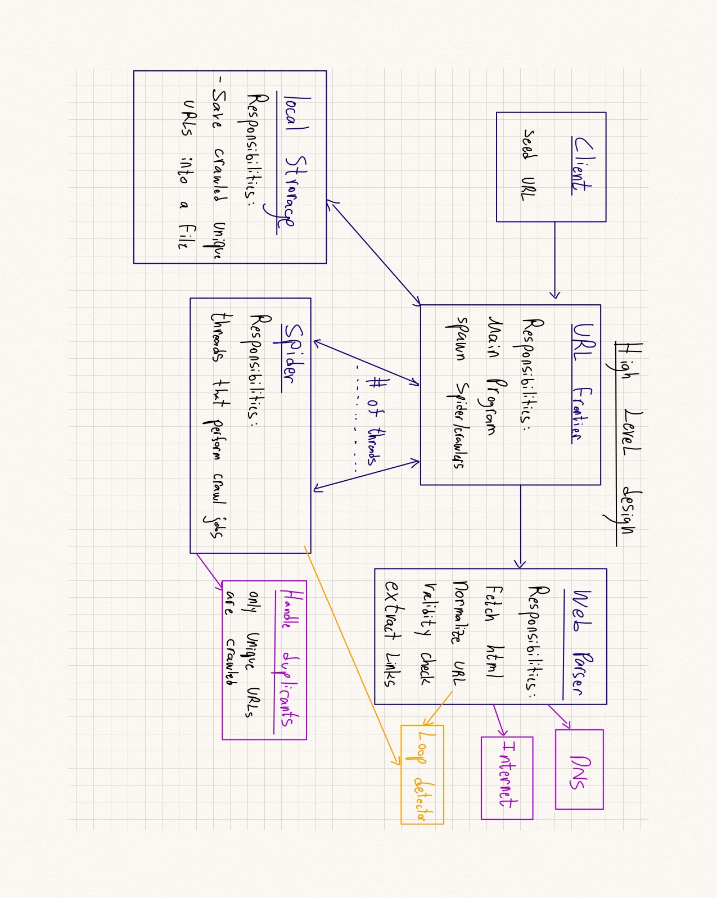

# Web Crawler Project

## Introduction
This project develops a simple web crawler capable of downloading all pages from a specific entry point to a local storage system.
This README.md file provides Guidelines for current implementation as well as ideas for a Sytem Design and further enhancements to improve the system.

## Task Clarifications
- **Single Entry**: The system currently supports a single entry point per crawling session.
- **Download Once**: We need to download each page only once.
- **Local Storage**: Data is stored locally.
- **Loops**: Provide basic solution for avoiding loops.
- **Multiple URL pointers**: multiple URLs can point to same Page.
- **Completion Indication**: create a basic mechanism for indication of succesful completion.
- **Efficiency**: as much as possible.

## Running instructions

### Prerequisites
**Python**: Ensure Python 3.6+ is installed on your system. [Download Python](https://www.python.org/downloads/)
    
### Running the Crawler
Navigate to the project directory and run the crawler using:
```bash
cd myWebCrawler
```
Run the program - it will ask you to provide base url
for example:
```bash
https://webscraper.io/test-sites/e-commerce/allinone
```

# Discussion
## System Design


The system is designed around several core components:

### Components Overview

#### 1. Client
- **Function**: Initiates the crawling process by providing the seed URL as input from user.

#### 2. URL Frontier
- **Responsibility**: Main program - manages spiders (threads) 
  - communication with all componants
  - Managing the databases of crawled/waiting urls.
- **Bottlenecks**:
  - currently not supporting websites policies (Politeness/robot.txt)
  - not supporting prioritization of specific urls
  - limited to # of threads by the single server running it.
- **Enhancements**:
  - **Politeness Policy**: Ensures the crawler does not overwhelm any server by following robot.txt rules - use proxy.
  - **Priority Queueing**: Uses a multi-level feedback queue (MLFQ) to prioritize URLs, in each level use Round Robin algorithm.
  - **Load Balancer**: a very important componant to add - will be reponsible for making sure no single thread/spider takes too many tasks,
    while other spiders remain unemployed

#### 3. Web Parser
- **Responsibility**: Fetche/Extract the HTML content of URLs from the internet.
- **Supporting Components**:
  - **DNS Lookup**: Resolves domain names (
  - **Implementation**: handeled by scrapy library

#### 4. Parser
- **Responsibility**: Parses the HTML content to extract new URLs and relevant data.
- **Additional functionality**: URLs are Normalized (Canonization) to ensure each URL matches a single Page.

#### 5. Handle Duplicates
- **Responsibility**: Identifies and handles duplicate pages that different URLs might point to.
- **Supporting Components**:
  - **Counter**: Saves a count field for each unique URL --> can be used to prioritize URLs to crawl first in URL FRONTIER.
  - **Implementation**: handeled by scrapy library
 
#### 4.URL Extractor
- **Responsibility**: Extract URL and create an ITEM for it.
 - **Implementation**: using Rules feature from scrapy library

#### 4. URL Visited Detector
- **Responsibility**: Checks if a URL has already been visited to avoid re-downloading the same page.
- **Data Structure**: Uses a dictionary to store URLs with a count of visits, ensuring O(1) in expectation for searches.

#### 7. Failed URL Handler
- **Responsibility**: Save all the URLs that we failed to extract
- **Data Structure**: Uses a list to store URLs that were not reachable
- **Optionality**: Automate the code so that if the list is not empty add them to URL frontier and keep the proccess running.

### Scalability
The system is designed to scale across multiple servers with regard to the following requirements:
- **Distributed Crawling**: The architecture supports distributing tasks across multiple crawling instances, using shared resources like URL databases and caches.
- **Load Balancing**: We will need to implement a mechanism that ensures that all servers are given similar amount of work and that URLs to crawl are spreaded equally. this can be implemeted as a load balancer for example that uses Round Robin algorithm.
- **Cache**: To prevent different servers crawling the same pages we can use the LRU algorithm and a url cache to ensure that if different servers get the task to crawl the same page that was already crawled they can just take it from a shared cache to extract relevant data from it.
- **Capacity Estimates**: Given the amount of web pages we need to crawl we can calculate how much time it will take us to complete the task with how many servers available while also taking in acount website policies.
simple example: Crawling 1 Bilion pages given that each page is 1MB to store. we will need 1 Bilion requests and 1PB memory space. if we want to complete the assingment in 1 week (600K seconds) we need 1B/600k = 1500 requests per second. in general home wifi it takes 0.5 second to load a webpage thus 750 threads per second and we can calculate how many CPUs we need for that.

## Data Handling
- **URL DB**: Implemeted by a Dictionary of URL items (url , count) , ensuring each page is only downloaded once.
- **Failed URLs**: List of URLs that failed to download, with errors logged for further analysis.
- **Bottlenecks--> Mitigation**:
    - Large data cannot be stored locally --> use external cloud based databases like mongoDB and use pipeline in scrappy to implement this.
    - Crash Consistency --> perform data storage in between the proccess operations and not just in the end to support consistency, for more sophisticated aproach we can use MetaData Journaling.  

